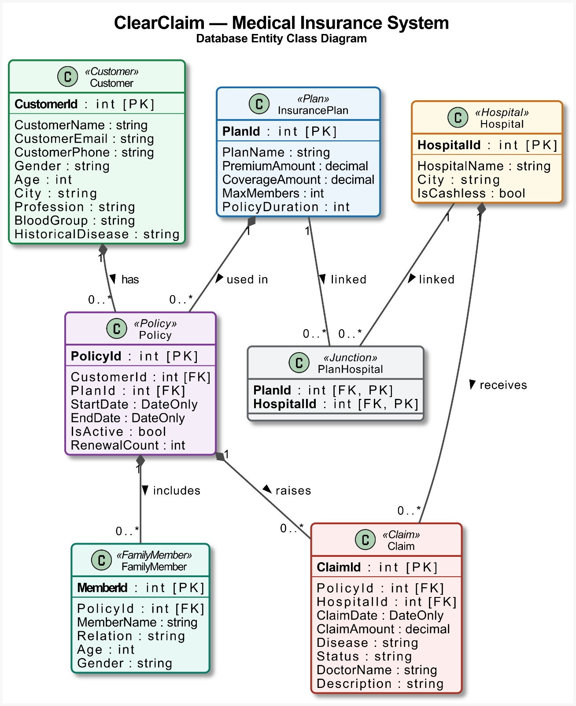

<div align="center">
  
  
  # ClearClaim — Medical Insurance Portal
  
  **A highly scalable, full-stack enterprise application for managing medical insurance policies, family members, hospitals, and claim processing.**

  [](https://reactjs.org/)
  [](https://www.typescriptlang.org/)
  [](https://dotnet.microsoft.com/)
  [](https://www.postgresql.org/)
</div>

<br />

> **Project Developed By:** Suyash Matade  
> **Company:** [Simplify Healthcare](https://simplifyhealthcare.com/)  
> **Mentor:** Special thanks to **Mahesh Sabnis Sir (Microsoft MVP)** for his invaluable guidance throughout this project.

---

## 📖 Table of Contents
1. [Project Overview](#-project-overview)
2. [9-Layer Clean Architecture](#-9-layer-clean-architecture)
3. [Database Schema](#-database-schema)
4. [Key Features](#-key-features)
5. [Tech Stack](#-tech-stack)
6. [Installation & Setup](#-installation--setup)

---

## 🎯 Project Overview
ClearClaim is a modern medical insurance portal designed to streamline the interaction between Customers, Hospitals, and Insurance Administrators. It provides a seamless interface for customers to browse policies, add family members, and submit medical claims, while administrators and hospitals can review, approve, or reject claims dynamically.

---

## 🏛 9-Layer Clean Architecture
This project is engineered using a highly modular **9-Layer Clean Architecture** paradigm combined with a strict **CQRS (Command Query Responsibility Segregation)** pattern. The design strictly enforces Separation of Concerns and Dependency Inversion, making the system highly scalable, maintainable, and decoupled from the UI.

### The CQRS Implementation:
* **Read Pipeline (Port 5234):** Utilizes **Dapper** (Micro-ORM) for lightning-fast, read-only SQL queries directly from the database.
* **Write Pipeline (Port 5130):** Utilizes **Entity Framework Core (EF Core)** to safely handle complex transactions, business validations, and state mutations.

### The 9 Layers:
1. **Domain.Entities:** Pure C# POCO classes modeling the PostgreSQL tables.
2. **Domain.Contract:** Interfaces defining the core business logic expectations.
3. **Domain.DataAccessContract:** Interfaces abstracting the database technology.
4. **ReadDataAccess (Dapper):** Implements data retrieval operations.
5. **WriteDataAccess (EF Core):** Implements transactional database mutations.
6. **ReadRepository:** Orchestrates the Read business logic.
7. **WriteRepository:** Enforces strict domain rules before saving.
8. **ReadAPI:** HTTP GET endpoints for the React frontend.
9. **WriteAPI:** HTTP POST/PUT/DELETE endpoints for the React frontend.

<div align="center">
  
</div>

---

## 🗄 Database Schema
The database is fully normalized and leverages **PostgreSQL Database Triggers** to enforce strict business rules at the lowest physical layer (e.g., preventing duplicate family relations, enforcing maximum plan members based on policy constraints, and performing age validations).

<div align="center">
  
</div>

*(Note: The full database creation script and triggers are available in the `/database/MedicalInsurance.sql` file).*

---

## ✨ Key Features
- **Role-Based Access Control (RBAC):** Distinct dashboards and capabilities for Customers, Hospitals, and Administrators.
- **Dynamic Database-Driven UI:** Forms (like Hospital Selection) are populated via live database queries based on the user's active policy constraints.
- **Fail-Safe Global Error Handling:** Custom Exception Middleware catches backend violations (like DB Trigger failures) and gracefully bubbles them up to the React UI without crashing.
- **Redux Persist:** Secure session management leveraging LocalStorage.
- **Robust Null-Safety:** Comprehensive empty-state handling across all frontend components.

---

## 💻 Tech Stack
| Frontend | Backend | Database & Tools |
| :--- | :--- | :--- |
| React 18 (Vite) | ASP.NET Core 8 Web API | PostgreSQL 16 |
| TypeScript | C# | pgAdmin |
| Redux Toolkit | Dapper (Micro-ORM) | Swagger / OpenAPI |
| Tailwind CSS | Entity Framework Core | Git / GitHub |
| Lucide Icons | 9-Layer Clean Architecture | Azure DevOps (CI/CD) |

---

## 🚀 Installation & Setup

### Prerequisites
- [Node.js](https://nodejs.org/en/) (v18+)
- [.NET 8 SDK](https://dotnet.microsoft.com/en-us/download/dotnet/8.0)
- [PostgreSQL](https://www.postgresql.org/download/) (v16+)

### 1. Database Setup
1. Open pgAdmin or your PostgreSQL CLI.
2. Create a new database named `medical_insurance`.
3. Execute the SQL script located at `database/MedicalInsurance.sql` to generate the tables, seed data, and triggers.

### 2. Backend Setup (.NET)
1. Navigate to the backend directory:
   ```bash
   cd Medical-Insurance
   ```
2. Update the Connection Strings:
   * Open `Com.Application.Domain.ReadAPI/appsettings.json`
   * Open `Com.Application.Domain.WriteAPI/appsettings.json`
   * Update the `"AppConn"` string with your local PostgreSQL password.
3. Start the Read API (Port 5234):
   ```bash
   cd Com.Application.Domain.ReadAPI
   dotnet run
   ```
4. Start the Write API (Port 5130):
   ```bash
   cd Com.Application.Domain.WriteAPI
   dotnet run
   ```

### 3. Frontend Setup (React/Vite)
1. Open a new terminal and navigate to the frontend directory:
   ```bash
   cd clearclaim-frontend
   ```
2. Install dependencies:
   ```bash
   npm install
   ```
3. Start the development server:
   ```bash
   npm run dev
   ```
4. Open your browser and navigate to `http://localhost:5173`.

---

<div align="center">
  <i>Built with passion at Simplify Healthcare.</i>
</div>